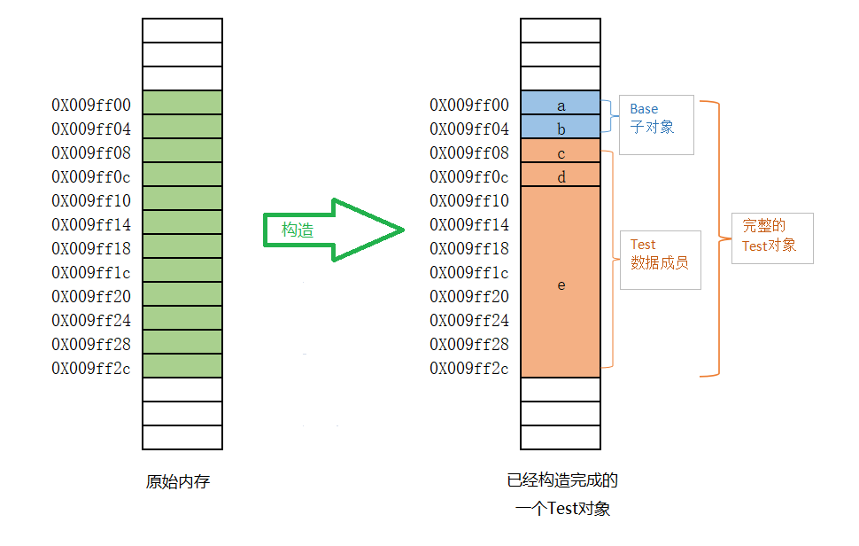

# 庖丁解牛 —— 一个对象的生与死


[toc]

# 0. 开胃小菜

``` cpp

#include <iostream>
#include <string>

using std::cout;
using std::endl;

class Test {
    public:
    Test(char *cstr)
        :str(cstr),
         size(str.size())
     {}

    int size;
    std::string str;
};

int main() {
    Test a{"12345"};
    cout << "size:" << a.size << "    str.size:" << a.str.size() << endl;
    return 0;
}

```

问题：

输出结果是什么：

A.  size:6    str.size:6
B.  size:5    str.size:5
C.  size:0    str.size:6
D.  size:0    str.size:5
E.  size:(一个不确定的值)    str.size:5


**一个恐怖的发现：C++编译器生成的目标代码跟你看到的代码不一样！**

   


# 1. 从0开始

##  示例

```cpp
#include <string>
class Base {
public:
    Base(){}
    int a;
    int b;
};

class Test : public Base {
public:
    int c;
    int d;
    std::string e;
};

int main()
{
    Test a;
}
```




**四个问题**

1. Test类没有显式定义构造函数，最终代码里却有一个Test的构造函数。
2. “多”出来的构造函数不但调用了基类的构造函数，还调用了成员对象的构造函数。
3. Test类没有显式定义析构函数，最终代码里却有一个Test的析构函数。
4. “多”出来的构造函数先调用了成员对象的构造函数， 还调用了基类的构造函数。


## c++对象构造和析构的一般特点

**自动生成：**如果需要，编译器会生成一个默认构造函数和析构函数。

**调用特点**  

   **构造函数**
   1. 首先，调用基类构造函数构造基类子对象。
   2. 然后，按声明顺序，调用数据成员的构造函数初始化数据成员，算术类型，指针类型如果没有明确指定初始化值，不被初始化
   3. 执行构造函数函数体

   **析构函数**
   1. 首先，执行析构函数函数体
   2. 然后，按照声明顺序的逆序调用数据成员的析构函数，算术类型，指针类型内容不被清除。
   3. 最后， 调用基类析构函数析构基类子对象。

# 

# 默认函数的行为探究

``` cpp
#include <string>
class Base
{
public:
    Base(){}
    Base(const Base &other){}
    Base& operator=(const Base &other){return *this;}
    ~Base(){}
};

class Test : public Base{
public:  
    int a;
    int *p;
    std::string b;
};

class Test1 : public Base{
public:
    Test1():b(){}
    
    Test1(const Test1 &other):b(other.b) {}
    
    Test1& operator=(const Test1 &other) {
        Base::operator=(other);
        a = other.a;
        p = other.p;  //Bug之源
        b = other.b;
        return *this;
    }
    
    ~Test1(){}
    
    int a;
    int *p;
    std::string b;
};

int main()
{
    Test a;
    Test b(a);
    b = a;
    
    Test1 c;
    Test1 d(c);
    d = c;
    return 0;    
}
```


通过对比Test和Test1两个类生成的汇编代码可以发现，编译器自动生成的函数与我们实现的函数行为是一致的。


在线C++编译工具

https://gcc.godbolt.org/


编译器会自动生成哪些函数


什么情况下不会自动生成。


1. 用户自己定义了
2. 用户定义了析构函数
